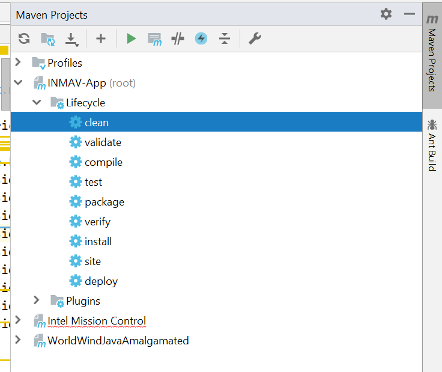
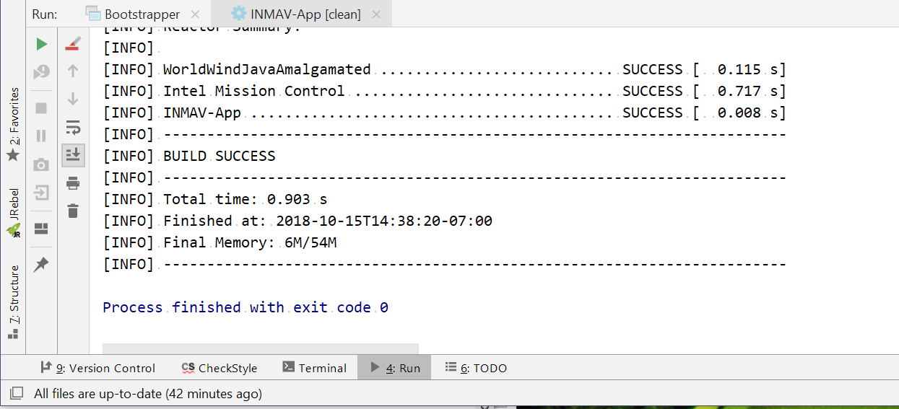

# IntelliJ not building?

First of all, I'm sorry! Take a deep breath! Do not punch your monitor (you will only hurt your hand and IntelliJ won't care) 

If IMC isn't building because some classes are WorldWind or Dronekit are missing here are some things you can try:
   
1. Refresh IntelliJ's Maven Cache 
    1. Make sure IMC is not running (otherwise Maven may not be able to clean some libraries)

    2. Open the 'Maven Projects' side bar either by clicking the tab on the right
       of the window or using the menu:
           'View' > 'Tool Windows' > 'Maven Projects'
    

    3. Run the 'Reimport All Maven Projects' by clicking on the refresh icon (🔄) at 
    the top left of the Maven pane

    3. **Run the 'clean' task** by double clicking it. You can see the task progress and check
    for errors by watching the run console that should automatically open on the bottom:
    

    4. **Run the 'run' task** by double clicking it. Again you can watch the progress and check
    that no errors occur. Depending on how slow your machine is (I'm looking at you Jaya) you may want to go get a coffee.

    5. Try doing your Build and Run as you normally would... If you see squiggly red lines somewhere, ignore them--Things
    will still probably be working. It's not broken unless it doesn't launch. So now everything is now working! Hooray!

2. If the above fails you might want to double check that your repository is clean of cruft, and retry step 1
    1. Check `git status` to see stuff that's not checked in
    2. You can run `git clean -n -f -d -X` to show 'dirty' files that are ignored by git for some reason and are not reported by `git status`. If you want to remove these files, you can run `git clean -f -d -X` (note the lack of the `-n` flag)
   
3. If step 1 fails after doing step 2 someone may have broken the build or something
