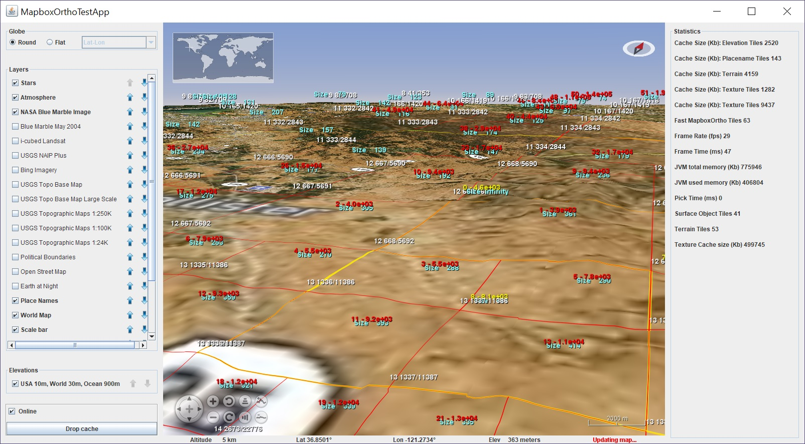

# FastMercatorTiledImageLayer (MapBox layer)

## Overview

This point of this class is to speed up MapTile loading. There are several performance issues with the way WorldWind's exisiting map layers download tiles that this class aims to improve the following:
1. **Loading unnecessary tiles** -- WW will happily download tiles that are not currently visible. For example, while panning the map WW will download tiles that were previously visible but no longer are.
2. **Poor prioritization of tile downloads** -- WW's download queue is basically FIFO, where the first requested map tile is the first tile downloaded. What we really want is for the most important tile to be downloaded first which is a priority queue: 
   - The priority of the tile should corrleate with how much the tile will improve the visual quality of the visible map (map in viewport). 
   - A tile in the middle of the viewport should have a higher priority than a tile in the corner of the viewport, which should have a higher priority than a tile than a tile which is not in the current viewport (not visible) or a tile that is at a much higher zoom level wich will not be used (in viewport, still not visible).
   -  This means as the viewport moves, the priority of the queued tiles need to be re-evaluated.
3. **Slow caching** -- WW's caching works in a way that is especially slow in the event of a cache miss (i.e. map tile not downloaded). The caching logic for WW's TiledImage is rough this:
    1. Try reading the image from disk, if load suceeds return image, if load fails (file doesn't exist) it's a cache miss, continue with step 2
    2. Queue download from web server
    3. When download complete, perform necessary transform and write this image to disk (i.e. cache write-back)
    4. Goto step 1 to load image off disk
 
    So loading a tile that isn't cached requires two file reads, one file write and a network request.

    What we really want is a write-through cache, where the cache residency is also stored in memory. Checking if tile is in cache should only require a memory lookup. Immediatly after being downloaded, the image can be displayed. The flush to disk cache can happen later. This is what FastMercatorTiledImage does (via OkHttpLibrary)

## Key classes
- `FastMercatorTiledImageLayer` -- a `BasicMercatorTiledImageLayer` that has customizable queuing logic which can be extended by providing a delegate object that implementing `$TileDownloadQueue`
- `FastMercatorTiledImageLayer$HttpClient` -- inner class that uses `OkHttp` to download tiles from the download queue. 
- `FancyDownloadQueue.java` -- default queue impl of above. Prioritizes visible tiles and limits number of non visible tiles that can be downloaded. Prioritizes downloads based on some heuristics to deal with issues #1 and #2 mentioned aboe.

  Core of queuing logic in `prioritize(DrawContext dc, ArrayList<MercatorTextureTile> tiles)`. Lots of visibility testing in here.

  Also, this class has a debug layer that will visually display tile boundaries, tile priority, estimated tile size on screen, and download status:
  
  

## Test app

### `FastMercatorTiledImageTestApp`

I have built a test harness to run the FastMercatorTiledImageLayer WorldWind layer outside of IMC, by using WorldWind's `ApplicationTemplate` class. The test app can show a debug layer that will display tile boundaries, tile address (zoom level/column/row), tile size (estimated pixels on screen), tile priority, and download status. Tiles with white border indicates that the texture for that tile is loaded, yellow border means tile is being loaded (reading off disk or from network), red border means the tile is queued to load. 

The test app also displays some statistics about numbers of tiles displayed, memory used and has controls to toggle online status and drop the tile cache.

#### To run:
From IntelliJ open the `FastMercatorTiledImageTestApp` class from the test source directory. Click the green run button in the gutter next to the `main` function at the bottom. If you get weird network error check that the run configuration of the test app doesn't have any VM options other than `-Dsun.java2d.uiScale=1.0`

Test app was working as of `develop` commit `2c4bf19f4683db3568e01306f0c70af068b7e568`
(Merge pull request #1195 in IMC/desktop from publish_os_libs to develop)

----

# Airmap Airspaces display

This is a complicated topic. See the code in the `com.intel.missioncontrol.airmap` package.

## Key Classes

- `TiledRenderableLayer` a WorldWind layer that manages a collection of `Renderables` that are grouped into tiles that load and unload. Is used by providing a delagate that implements the `TileRenderableManager`
- `AirMapTileLoader2` Lods Tile data and manages renderable cache, probably needs to be split up into these two responsibilities.
  
  This class is complicated mostly to deal with the fact that one airspace object will appear in multiple tiles. We want to keep a one to one mapping between airspaces and visibleRenderableMap, and want duplicate airspace objects in different tiles to actually only be aliases and point to the same object. We also don't want to these airspace objects to get added to the renderable layer multiple times. To do this we keep track of these objects across tile loads/unloads via reference counting `AirMapTileLoader2$AirSpaceRenderablePair`.

  This code is kind of nasty but it works...
- `AirSpaceObjectFactory` create renderables from AirMap Objects (which is the data structures in the `com.intel.missioncontrol.airmap.data` package)
- `AirMap` makes AirMap API calls using OkHttp. Deserializes JSON into Java objects found in the `airmap.data` package

## Test app

There's a test app `AirspaceTestApp` so you can test the Airmap layer without running all of IMC. The test app also has a debug layer that can be enabled that will show how the AirMap queries are broken down into tiles and the tile name, loading status, and number of renderable items in that tile

#### To run:
From IntelliJ open the `AirspaceTestApp` class from the test source directory. Click the green run button in the gutter next to the `main` function at the bottom. If you get weird network error check that the run configuration of the test app doesn't have any VM options other than `-Dsun.java2d.uiScale=1.0`

